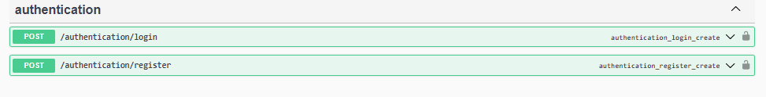

  [](https://coveralls.io/github/jeffnyalik/docker-summary?branch=master)
 <h4> Savannah Informatics Backend Technical Challenge</h4>

The goal of this assignment is to develop a simple Python or Go service that includes a database for customers and orders. 
Additionally, you need to create a REST or GraphQL API to input and upload customer and order data. The API should also implement authentication and authorization using Django OAuth Toolkit with OpenID Connect. Finally, you are required to send an SMS alert to the customer when an order is added

    Prerequisites:
    1.Docker
    2.Django OAuth2 Toolkit - OpenID Connect
    3.PostgreSQL</li>
    4.Africa's Talking SMS Gateway
    5.Django & Django Rest Framework

<h4>Installation</h4>
1. Clone the repository from GitHub

``` https://github.com/jeffnyalik/customer-orders.git ```

2 Change into the project directory:
	```cd your-repo```
3. Set up the database:
	``` 
Create a PostgreSQL database with the name  `customers_orders_db`.
-   Update the database configuration in  `settings.py`  (for Python)  match 		    your PostgreSQL settings.
	```
4.Build and run the Docker containers:
	``` docker-compose up -d or docker-compose up --build ```

Africastalking Config:
`` python3 -m pip install africastalking``
```
## Africastalking configs/ settings.py file
AFRICASTALKING_USERNAME = 'sandbox'
AFRICASTALKING_API_KEY= #Sandbox API Key
SENDER_SHORT_CODE = '1234' #Your sandbox shortcode
```
Sample Request and Response:

Upon making an order request, the customer will get an sms alert as shown below:


####  API Endpoints


####  Authentication Endpoints


####  Authentication and Authorization
This project implements authentication and authorization using Django OAuth Toolkit with OpenID Connect. To set up authentication and obtain the necessary credentials, please follow these steps:

`` pip install django-oauth-toolkit``

```
1.  Configure the OpenID Connect provider with the necessary client credentials and scopes.
    
2.  Update the OAuth Toolkit configuration in  `settings.py`  to match your OpenID Connect provider settings.
    
3.  Update the client ID and client secret in the  `.env`  file.
    
4.  Restart the Docker containers:
```

docs: https://django-oauth-toolkit.readthedocs.io/en/latest/install.html
To register an app, you have to go to 
`[http://localhost:8000/o/applications/]`

Here you will grab the `client_id` and` client_secret`.
You can get ConnectDiscoveryInfoView

Available at  `/o/.well-known/openid-configuration`, this view provides auto discovery information to OIDC clients, telling them the JWT issuer to use, the location of the JWKs to verify JWTs with, the token and userinfo endpoints to query, and other details.

I have created a custom user that uses the token  endpoint for generating access token upon successful login.
`  
token_endpoint

`[http://localhost:8000/o/token/]`
The token can be used to authenticate and authorize for the next subsequent API calls.

#### DiscoveryInfoView Endpoints


#### Successful Login


###  Author
Jeff Nyalik - <a href="https://github.com/jeffnyalik">GitHubProfile </a>

``Happy Coding!!.``